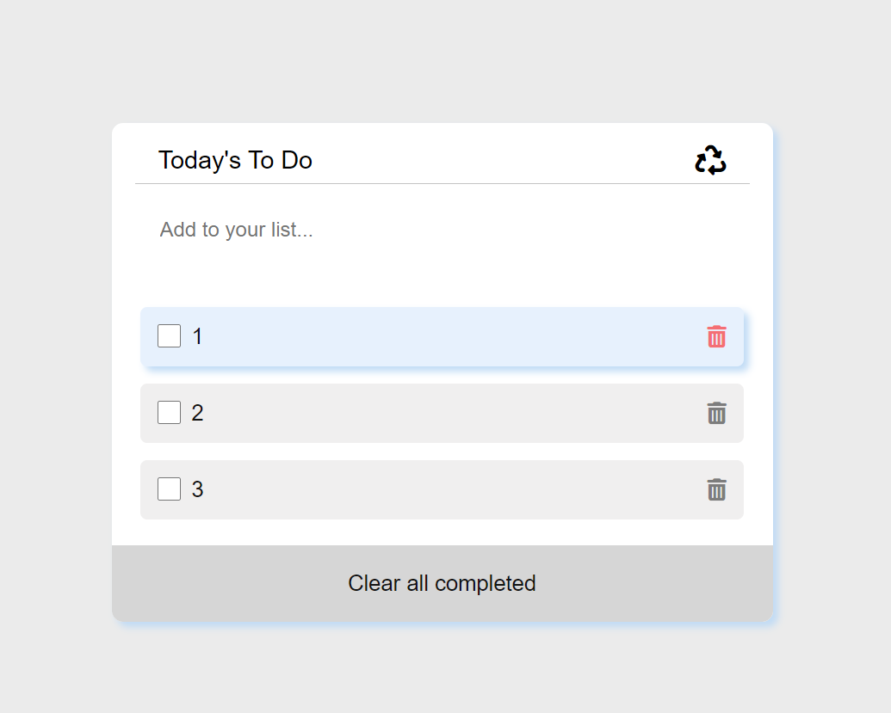

# Book list

> This web app is about making a book list

> This site contans
>- An add form that adds the todos

Additional description about the project and its features.

## live demo

- project: (https://eng-mohamed-eldeeb.github.io/todo_list/)

## Install

- Install node.js from [HERE](https://nodejs.org/en/).
  
## Run locally

1. Clone the project using git-bash or Githup Desktop.
2. Open the project folder with VSCode or any Editor.
3. Open terminal and navigate to the project folder.
4. Type `npm install`.
5. Type `npm start`.

## Built With

- HTML
- CSS
- JS

## Authors

👤 **MOHAMED EL DEEB**

- GitHub: [@githubhandle](https://github.com/eng-mohamed-eldeeb)
- Twitter: [@twitterhandle](https://https://twitter.com/eldeeb_3o)
- LinkedIn: [LinkedIn](https://https://www.linkedin.com/in/mohamed-eldeeb-a69022206/)

## Show your support

Give a ⭐️ if you like this project!

## 📝 License

This project is [MIT](./MIT.md) licensed.
